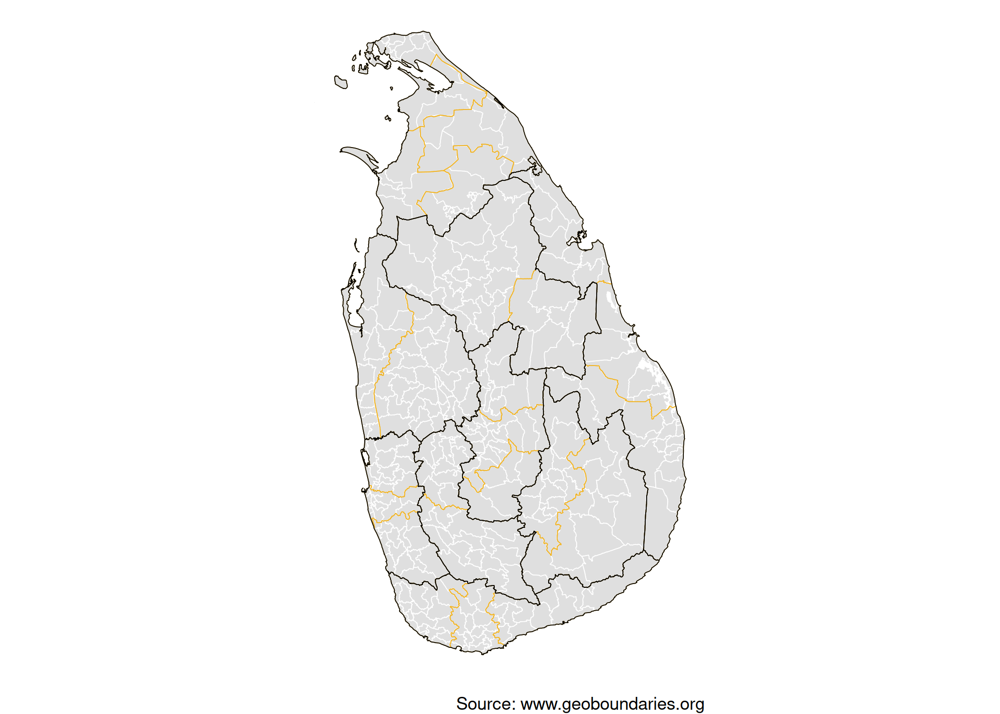
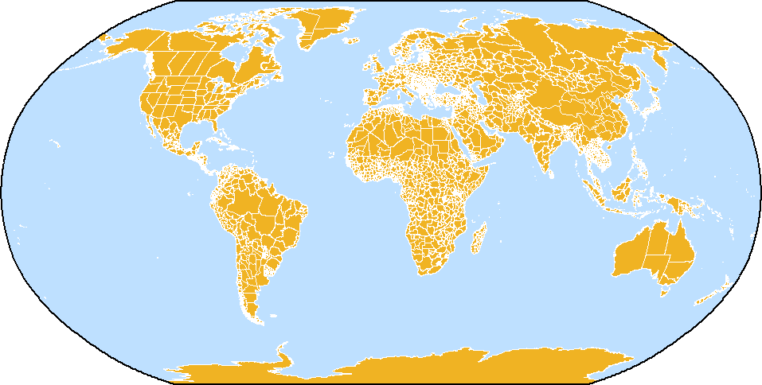

<!-- README.md is generated from README.Rmd. Please edit that file -->

# rgeoboundaries 

<!-- badges: start -->

[](https://github.com/dieghernan/rgeoboundaries/actions/workflows/check-full.yaml)
[](https://github.com/dieghernan/rgeoboundaries/actions/workflows/rhub.yaml)
[](https://app.codecov.io/gh/dieghernan/rgeoboundaries)
[](https://www.codefactor.io/repository/github/dieghernan/rgeoboundaries)
[](https://www.repostatus.org/#active)
[](https://doi.org/10.1371/journal.pone.0231866)
[](https://opensource.org/licenses/MIT)

<!-- badges: end -->

[**Attribution**](https://www.geoboundaries.org/index.html#usage) **is
required when using geoBoundaries.**

## Why this package?

The **rgeoboundaries** package provides an **R**-friendly interface to
access and work with the
[**geoBoundaries**](https://www.geoboundaries.org/) dataset (an
open-license global database of administrative boundary polygons). Using
this package, you can:

- Programmatically retrieve administrative boundary geometries (e.g.,
  country → region → district) from geoBoundaries
- Use **tidyverse** / **sf** workflows in **R** to map, analyse and join
  these boundaries with your own data
- Work in an open-data context (geoBoundaries uses [CC
  BY-4.0](https://creativecommons.org/licenses/by/4.0/)) / open
  licences[^1])

In short: if you work with geospatial boundaries in **R** (shapefiles,
polygons, join with other data), this package simplifies the process.

## Installation

You can install the developing version of **rgeoboundaries** with:

``` r
# install.packages("pak")
pak::pak("dieghernan/rgeoboundaries")
```

## Example usage

### Single country

``` r
library(rgeoboundaries)

sri_lanka_adm1 <- gb_get_adm1("Sri Lanka")
sri_lanka_adm2 <- gb_get_adm2("Sri Lanka")
sri_lanka_adm3 <- gb_get_adm3("Sri Lanka")

library(sf)
library(dplyr)

library(ggplot2)

ggplot(sri_lanka_adm3) +
  geom_sf(fill = "#DFDFDF", color = "white") +
  geom_sf(data = sri_lanka_adm2, fill = NA, color = "#F0B323") +
  geom_sf(data = sri_lanka_adm1, fill = NA, color = "black") +
  labs(caption = "Source: www.geoboundaries.org") +
  theme_void()
```



### World dataset

See how the map of the logo can be created:

``` r
library(rgeoboundaries)
library(sf)
library(dplyr)
library(ggplot2)


world <- gb_get_world(adm_lvl = 1)

# Template: Sea as background
bbox_template <- st_bbox(world)

sea <- c(-179.9, -89, 179.9, 89)
names(sea) <- names(bbox_template)
class(sea) <- class(bbox_template)

sea_poly <- sea |>
  st_as_sfc() |>
  st_set_crs(st_crs(world)) |>
  st_segmentize(dfMaxLength = 50000)

sea_line <- sea_poly |> st_cast("LINESTRING")
ggplot(sea_poly) +
  geom_sf(fill = "#bee0ff") +
  geom_sf(
    data = world, fill = "#f0b323", color = "white",
    linewidth = 0.1
  ) +
  geom_sf(data = sea_line, color = "black") +
  coord_sf(expand = TRUE, crs = "+proj=robin") +
  theme_void()
```

<div class="figure">


<p class="caption">

Map on the rgeoboundaries logo
</p>

</div>

## Documentation & Resources

- Visit the **pkgdown** site for full documentation:
  <https://dieghernan.github.io/rgeoboundaries/>
- Explore the geoBoundaries homepage: <https://www.geoboundaries.org/>
- Read the original paper describing the geoBoundaries dataset ([Runfola
  et al. 2020](#ref-geoboundaries)).

## License

This package is released under the
[MIT](https://opensource.org/license/mit) license. Note that the
boundary data being accessed (via geoBoundaries) also uses open
licences; please check the specific dataset metadata for licensing
details.

## Acknowledgements

- Many thanks to the geoBoundaries team and the [William & Mary
  geoLab](https://sites.google.com/view/wmgeolab/) for creating and
  maintaining the dataset.
- Thanks to the **R** package community and all contributors to this
  package’s development.
- If you use **rgeoboundaries** (and underlying geoBoundaries data) in
  your research or project, a citation and acknowledgement is greatly
  appreciated.

## How to cite

If you are using this package in your analysis, please cite the original
geoBoundaries work:

> Runfola, D. et al. (2020) geoBoundaries: A global database of
> political administrative boundaries. *PLoS ONE* 15(4): e0231866.
> <https://doi.org/10.1371/journal.pone.0231866>

A BibTeX entry for LaTeX users:

    @Article{10.1371/journal.pone.0231866,
      doi = {10.1371/journal.pone.0231866},
      author = {Daniel Runfola and Austin Anderson and Heather Baier and Matt Crittenden and Elizabeth Dowker and Sydney Fuhrig and Seth Goodman and Grace Grimsley and Rachel Layko and Graham Melville and Maddy Mulder and Rachel Oberman and Joshua Panganiban and Andrew Peck and Leigh Seitz and Sylvia Shea and Hannah Slevin and Rebecca Youngerman and Lauren Hobbs},
      journal = {PLoS ONE},
      publisher = {Public Library of Science},
      title = {geoBoundaries: A global database of political administrative boundaries},
      year = {2020},
      month = {4},
      volume = {15},
      pages = {1-9},
      number = {4},
    }

## Legal

With respect to works on or made available through download from this
website, we make no representations or warranties - express, implied, or
statutory - as to the validity, accuracy, completeness, or fitness for a
particular purpose; nor represent that use of such works would not
infringe privately owned rights; nor assume any liability resulting from
use of such works; and shall in no way be liable for any costs,
expenses, claims, or demands arising out of use of such works.

## References

<div id="refs" class="references csl-bib-body hanging-indent"
entry-spacing="0">

<div id="ref-geoboundaries" class="csl-entry">

Runfola, Daniel, Austin Anderson, Heather Baier, Matt Crittenden,
Elizabeth Dowker, Sydney Fuhrig, Seth Goodman, et al. 2020.
“geoBoundaries: A Global Database of Political Administrative
Boundaries.” *PLoS ONE* 15 (4): 1–9.
<https://doi.org/10.1371/journal.pone.0231866>.

</div>

</div>

[^1]: Individual data files in the geoBoundaries database are governed
    by the license or licenses identified within the metadata for each
    respective boundary. Users using individual boundary files from
    geoBoundaries should additionally ensure that they are citing the
    sources provided in the metadata for each file.
