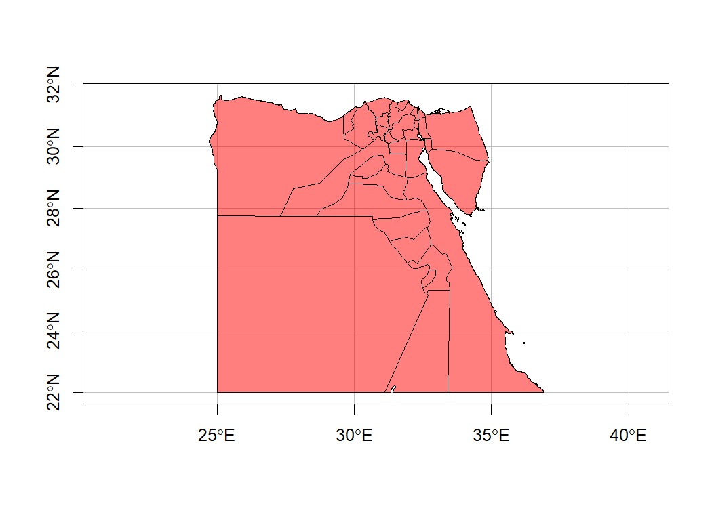

<!-- README.md is generated from README.Rmd. Please edit that file -->

# rgeoboundaries 

<!-- badges: start -->

[](https://gitlab.com/dickoa/rgeoboundaries/pipelines)
[](https://ci.appveyor.com/project/dickoa/rgeoboundaries)
[](https://codecov.io/gl/dickoa/rgeoboundaries)
[](https://cran.r-project.org/package=rgeoboundaries)
[](https://opensource.org/licenses/MIT)

<!-- badges: end -->

`rgeoboundaries` is an R client for the [geoBoundaries
API](https://www.geoboundaries.org/), providing country political
administrative boundaries.

## Installation

You can install the development version of rgeoboundaries using the
`remotes` package:

``` r
# install.packages("remotes")
remotes::install_gitlab("dickoa/rgeoboundaries")
remotes::install_github("wmgeolab/rgeoboundaries")
```

## Access administrative boundaries using rgeoboundaries

This is a basic example which shows you how get Mali and Senegal
boundaries and plot it

``` r
library(rgeoboundaries)
library(sf)
mli_sen <- gb_adm0(c("mali", "senegal"), type = "sscgs")
plot(st_geometry(mli_sen))
```


We can also get the first administrative division of all countries in
the world and use ISO3 code too

``` r
egy <- gb_adm1("EGY")
plot(st_geometry(egy),
     col = rgb(red = 1, green = 0, blue = 0, alpha = 0.5),
     axes = TRUE, graticule = TRUE)
```



In order to access the global administrative zones, you just need to
skip the country argument (i.e set it to `NULL`) or specify
`type = "CGAZ"`.

``` r
world <- gb_adm1()
world_lambert <- st_transform(world, "+proj=laea +x_0=0 +y_0=0 +lon_0=0 +lat_0=0")
par(bty = "n")
plot(st_geometry(world_lambert),
     col = "#E39d57",
     graticule = TRUE, lwd = 0.3)
```


Finally, metadata for each country and administrative level are also
available.

``` r
knitr::kable(gb_metadata(c("mali", "senegal"), "adm1"))
```

|  | boundaryID | boundaryName | boundaryISO | boundaryYearRepresented | boundaryType | boundaryCanonical | boundarySource | boundaryLicense | licenseDetail | licenseSource | boundarySourceURL | sourceDataUpdateDate | buildDate | Continent | UNSDG-region | UNSDG-subregion | worldBankIncomeGroup | admUnitCount | meanVertices | minVertices | maxVertices | meanPerimeterLengthKM | minPerimeterLengthKM | maxPerimeterLengthKM | meanAreaSqKM | minAreaSqKM | maxAreaSqKM | staticDownloadLink | gjDownloadURL | tjDownloadURL | imagePreview | simplifiedGeometryGeoJSON |
|:---|:---|:---|:---|:---|:---|:---|:---|:---|:---|:---|:---|:---|:---|:---|:---|:---|:---|:---|:---|:---|:---|:---|:---|:---|:---|:---|:---|:---|:---|:---|:---|:---|
| 2 | MLI-ADM1-92416918 | Mali | MLI | 2021 | ADM1 | Region or Capital District | DNCT - Direction Nationale des Collectivités Territoriales, United Nations Office for the Coordination of Humanitarian Affairs, Mali | Creative Commons Attribution 4.0 International (CC BY 4.0) | nan | data.humdata.org/dataset/administrative-boundaries-cod-mli | data.humdata.org/dataset/administrative-boundaries-cod-mli | Thu Jan 19 07:31:04 2023 | Dec 12, 2023 | Africa | Sub-Saharan Africa | Western Africa | Low-income Countries | 9 | 1333.0 | 342 | 3414 | 2058.908469995114 | 83.68262922173119 | 3760.358176000396 | 139367.46925829045 | 245.6744280437728 | 499273.8882641518 | <https://github.com/wmgeolab/geoBoundaries/raw/9469f09/releaseData/gbOpen/MLI/ADM1/geoBoundaries-MLI-ADM1-all.zip> | <https://github.com/wmgeolab/geoBoundaries/raw/9469f09/releaseData/gbOpen/MLI/ADM1/geoBoundaries-MLI-ADM1.geojson> | <https://github.com/wmgeolab/geoBoundaries/raw/9469f09/releaseData/gbOpen/MLI/ADM1/geoBoundaries-MLI-ADM1.topojson> | <https://github.com/wmgeolab/geoBoundaries/raw/9469f09/releaseData/gbOpen/MLI/ADM1/geoBoundaries-MLI-ADM1-PREVIEW.png> | <https://github.com/wmgeolab/geoBoundaries/raw/9469f09/releaseData/gbOpen/MLI/ADM1/geoBoundaries-MLI-ADM1_simplified.geojson> |
| 6 | SEN-ADM1-71046170 | Senegal | SEN | 2019 | ADM1 | region | Government of Senegal, OCHA ROWCA | Creative Commons Attribution 3.0 Intergovernmental Organisations (CC BY 3.0 IGO) | nan | data.humdata.org/dataset/senegal-administrative-boundaries | data.humdata.org/dataset/senegal-administrative-boundaries | Thu Jan 19 07:31:04 2023 | Dec 12, 2023 | Africa | Sub-Saharan Africa | Western Africa | Low-income Countries | 14 | 1785.0 | 627 | 6052 | 659.6438524808731 | 166.34887893257255 | 1457.2982019784088 | 14049.370925483614 | 544.0479780089397 | 42624.70879887685 | <https://github.com/wmgeolab/geoBoundaries/raw/9469f09/releaseData/gbOpen/SEN/ADM1/geoBoundaries-SEN-ADM1-all.zip> | <https://github.com/wmgeolab/geoBoundaries/raw/9469f09/releaseData/gbOpen/SEN/ADM1/geoBoundaries-SEN-ADM1.geojson> | <https://github.com/wmgeolab/geoBoundaries/raw/9469f09/releaseData/gbOpen/SEN/ADM1/geoBoundaries-SEN-ADM1.topojson> | <https://github.com/wmgeolab/geoBoundaries/raw/9469f09/releaseData/gbOpen/SEN/ADM1/geoBoundaries-SEN-ADM1-PREVIEW.png> | <https://github.com/wmgeolab/geoBoundaries/raw/9469f09/releaseData/gbOpen/SEN/ADM1/geoBoundaries-SEN-ADM1_simplified.geojson> |

## How to to cite

If you are using this package in your analysis, please cite the original
`geoBoundaries` work:

> Runfola D, Anderson A, Baier H, Crittenden M, Dowker E, Fuhrig S, et
> al. (2020) geoBoundaries: A global database of political
> administrative boundaries. PLoS ONE 15(4): e0231866.
> <https://doi.org/10.1371/journal.pone.0231866>
